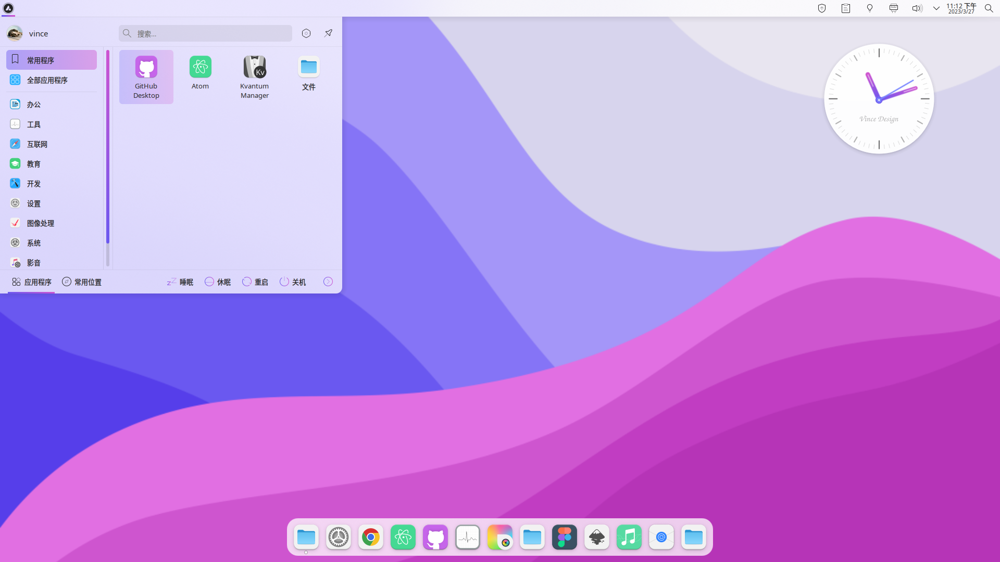
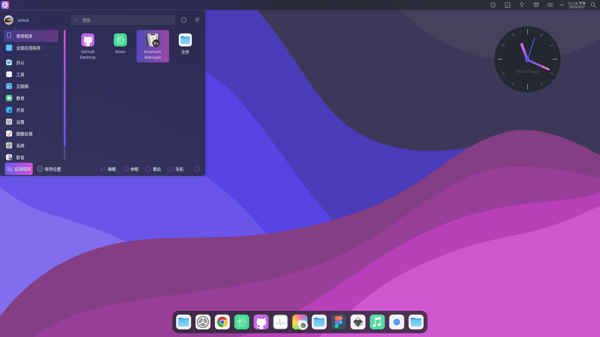

## Lavanda KDE Theme

Lavanda kde theme is a clean and concise theme for KDE Plasma 6 desktop.

Requires Plasma 6.1+ (Qt 6.5+).

In this repository you'll find:

- Aurorae Theme
- Kvantum Theme
- Wallpaper Theme
- Plasma Color Scheme
- Plasma Desktop Theme
- Plasma Global Theme
- SDDM Theme (with zh_CN localization)

## Installation

```sh
./install.sh
```

The installer will prompt whether to install the SDDM theme (requires root).

To install SDDM theme manually:

```sh
sudo ./sddm/6.0/install.sh
```

Then set `Current=Lavanda` or `Current=Lavanda-Sea` in `/etc/sddm.conf`.

## Uninstall

```sh
./uninstall.sh
```

## Recommendations

- For better looking please use this pack with [Kvantum engine](https://github.com/tsujan/Kvantum/blob/master/Kvantum/INSTALL.md#distributions).

  Run `kvantummanager` to choose and apply **Lavanda** (or any other Lavanda) theme.

- Install [Colloid icon theme](https://github.com/vinceliuice/Colloid-icon-theme) for a more consistent and beautiful experience.

- Install [Lavanda gtk theme](https://github.com/vinceliuice/Lavanda-gtk-theme) for a more consistent and beautiful experience.

## License

GNU GPL v3

## Preview





